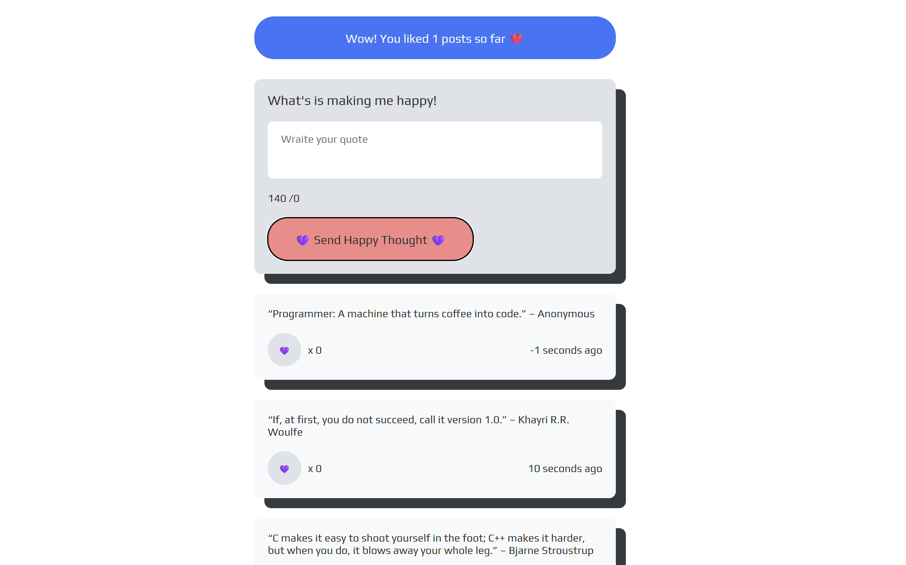

# 😻 Happy Thoughts

**Happy Thoughts** is a modern, interactive React app built during Technigo’s JavaScript Bootcamp (December 2025). The project allows users to read, like, and post positive thoughts, featuring dynamic content, interactive buttons, and responsive design.

The live project is available on [Netlify](https://happy-thoughts-2025.netlify.app/)

---

## 🔗 Demo

Check it out here: [Happy Thoughts Live Demo](#https://happy-thoughts-2025.netlify.app/)

---

## 📸 Screenshot



---

## 🚀 Features

- 📝 **Post Thoughts:** Users can submit their own happy thoughts.
- ❤️ **Like Button:** Interactive heart button with animated “jump” effect when clicked.
- ⏱️ **Time Ago:** Posts display how many seconds, minutes, hours, or days ago they were added.
- 📦 **Dynamic Content:** Thoughts are fetched from a backend API and updated in real-time.
- 📱 **Responsive Design:** Works on desktop, tablet, and mobile.
- 🎨 **Styled Components:** Interactive UI elements like buttons, counters, and lists are fully styled with animations.
- 😻 **User Feedback:** Friendly messages for users depending on the number of liked posts.

---

## 🧰 Tech Stack / What I Built With

- **React.js** for building modular components and managing state
- **Styled-Components** for dynamic styling, animations, and media queries
- **JavaScript (ES6+)** for logic, fetching API data, and interactive UI
- **Fetch API** for retrieving and posting thoughts
- **Vite** for fast development and bundling
- **SVG Icons & Lucide** for interactive buttons and UI elements

---

## 🧠 How It Works

1. **Fetch Thoughts:** Data is retrieved from a backend API using `fetch` and `useEffect`.
2. **Display Posts:** Posts are rendered dynamically with like counts and timestamps.
3. **Like Functionality:** Users can like posts, triggering animated heart buttons and updating counters.
4. **Post Submission:** Users can submit new happy thoughts, which are added to the top of the feed.
5. **Friendly Messages:** Depending on the number of likes, messages update dynamically.
6. **Responsive Layout:** Uses styled-components and CSS media queries to adapt the UI across devices.

---

## 📂 File Structure

```
📂 src/
|
├── App.jsx
├── Form.jsx
├──LikedPost.jsx
├──Loading.jsx
├──Main.jsx
├──Quote.jsx
├──RichedLimit.jsx
├──TooLong.jsx
└──TooShort.jsx

```

---

## 📝 What I Learned

- Structuring a React project with reusable, interactive components
- Fetching and displaying dynamic content from an API
- Implementing **animated buttons** and friendly messages
- Managing component state with hooks like `useState` and `useEffect`
- Creating **responsive layouts** with styled-components
- Handling form input and dynamically updating lists

---

## 📄 License

This project is free to use for educational purposes.
